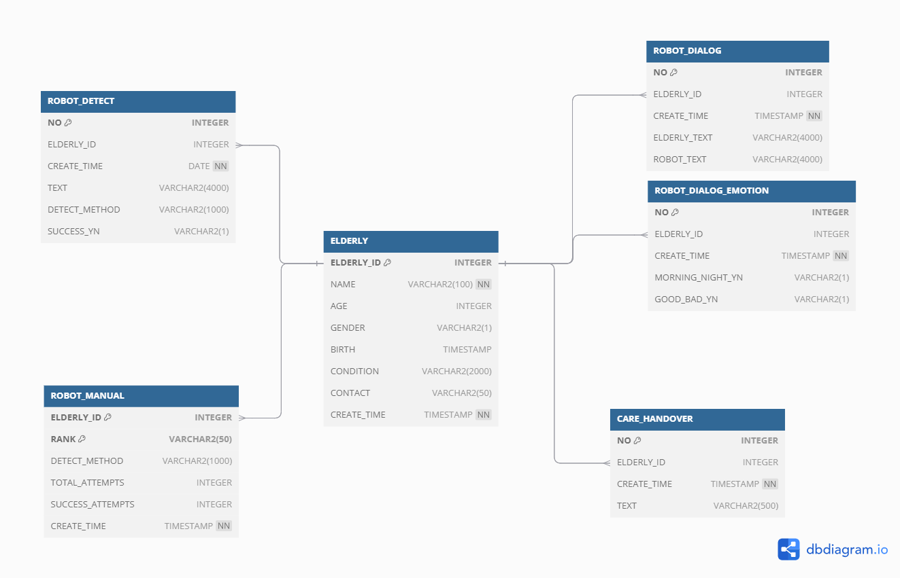

<h2>LG전자 DX SCHOOL 1기 CX 최종 프로젝트 - 1반 6's Sense</h2>

김지연 김민성 배기옥 이승현 장민서

<h2>요양보호사를 위한 AI 돌봄 로봇 휴(休)</h2>
어르신과의 대화를 분석하여 감정 상태와 선호도를 파악하고 맞춤형 대응을 제공해
 
어르신의 복지 향상 및 요양보호사의 업무 효율성을 증대하는 로봇과 대시보드 개발 프로젝트입니다.

## 목차
- [프로젝트명](#프로젝트명)
- [서비스 소개](#서비스-소개)
- [프로젝트 기간](#프로젝트-기간)
- [주요기능](#주요기능)
- [기술스택](#기술스택)
- [데이터분석/수집/시각화/프레임워크 단위기술](#데이터분석/수집/시각화/프레임워크-단위기술)
- [시스템 아키텍처](#시스템-아키텍처)
- [서비스 흐름도](#서비스-흐름도)
- [유스케이스](#유스케이스)
- [ER 다이어그램](#ER-다이어그램)
- [화면구성](#화면구성)
- [팀원역할](#팀원역할)
- [트러블슈팅](#트러블슈팅)
- [팀원역할](#팀원역할)
- [버전 및 업데이트 정보](#버전-및-업데이트-정보)
- [FAQ](#FAQ)

## 프로젝트명
- 프로젝트 이름 : 요양보호사를 위한 AI 돌봄 로봇 휴(休)
- 팀명 : 6's Sense
- 팀원 : 김지연, 김민성, 배기옥, 이승현, 장민서

## 서비스 소개
"휴(休)"는 요양보호사들이 돌보는 어르신의 상태를 모니터링하고, 맞춤형 돌봄을 제공하는 AI 기반의 돌봄 로봇입니다. 요양보호사의 업무 부담을 줄이고, 치매 어르신의 정서적 안정을 돕는 기능을 제공합니다.

## 프로젝트 기간
- 수업 : 07/11 ~ 09/04 (8주)
- 집중프로젝트 : 09/05 ~ 09/13 (1주)

## 주요기능
- 맞춤형 대화 기능 : 어르신의 감정 상태와 취향을 분석하여 맞춤형 대화를 제공
- 대응 메뉴얼 제공 : 어르신의 상태에 맞춰 요양보호사에게 대응 매뉴얼을 제공
- 상태 모니터링 : 실시간으로 어르신의 정서 상태를 대시보드에서 확인 가능
- 엔터테인먼트 기능 : 어르신이 좋아하는 음악이나 영상을 제공하여 정서적 안정 도모

## 기술스택 
- 프론트엔드 : HTML5, CSS3, JS
- 백엔드 : Spring Boot, Java, Python
- DB : Oracle, MyBatis
- AI 및 데이터 분석 : Python
- 버전 관리 : GitHub

## 데이터분석/수집/시각화/프레임워크 단위기술
- TF-IDF (Term Frequency-Inverse Document Frequency) : 유튜브, 카페, 뉴스에서 자주 사용되는 단어들의 빈도와 중요도를 계산하여 핵심 키워드를 추출하였습니다.
- LDA (Latent Dirichlet Allocation) : 유튜브 데이터를 주제별로 분류하여, 요양보호사가 인터넷 상으로 남긴 다양한 의견을 파악하고 분석하였습니다.
- WordCloud : 키워드 기반 유튜브 데이터에서 중요한 단어들을 시각적으로 표현하여 직관적으로 파악하여 구체적인 주제 및 페인포인트를 도출 했습니다.
- Word2Vec : 단어 임베딩을 통해 주제를 더 깊이 이해하고, 대화 내용의 의미적 연관성을 분석하였습니다.
- LDA를 통한 Action 식별 : 구체적인 action 설정으로 요양보호사와 어르신을 위한 새로운 솔루션 방안을 제시하였습니다.
- Customer Action Map(CAM) : 각기 다른 요양보호사의 행동을 분석하고, 더 나은 서비스를 제공하기 위한 지도를 작성하였습니다.
- 허깅페이스 Summarize 모델 : 대화 원문 요약을 통해 긴 대화를 간결하게 정리하고, 필요한 내용을 빠르게 파악할 수 있게 하였습니다.
- 허깅페이스 Korean Sentiment 모델 : 어르신들의 대화에서 감정 상태를 분석하여 긍정/부정을 구분하고, 이를 바탕으로 감정 변화를 추적하였습니다.

## 시스템 아키텍처
- 로봇(휴(休)) : 어르신과의 대화를 통해 감정 상태를 분석 및 맞춤형 대응을 제공
- 대시보드 : 웹 기반의 UI를 통해 요양보호사들이 실시간으로 데이터를 확인하고 업무반영 가능
- 클라우드 서버 : 어르신의 데이터 저장 및 분석을 담당, 맞춤형 대응을 실시간으로 제공

## 유스케이스
[별첨]

## 서비스 흐름도
[별첨]

## ER 다이어그램

## 화면구성
[별첨]

## 팀원역할
- 김지연 (팀장) : 전체 프로젝트 관리 및 백엔드(AI 분석) 개발, 문서작성
- 김민성 : 프론트엔드 개발, 문서작성
- 배기옥 : 백엔드(데이터베이스 설계 및 데이터 처리 로직) 구현 및 개발, 문서작성
- 이승현 : PPT 제작, 문서작성
- 장민서 : PPT 제작 및 발표, 문서작성

## 트러블슈팅
- 데이터 처리 속도 문제: 초기에 데이터 처리 속도가 느려 실시간 처리가 어려웠으나, AI 모델 최적화를 통해 해결.
- 감정 분석 정확도 문제: 로봇의 감정 분석이 일관되지 않았으나, 데이터셋을 개선하여 안정적인 결과 도출.

## 버전 및 업데이트 정보
- v1.0 (2024-09-13): 프로젝트 초기 버전, 감정 분석 및 대화 기능 구현
- v2.0 (2024-10-예정) : 해커톤 참가를 위한 flask 및 데이터 실시간 처리(ChatGPT API) 기능 구현

## FAQ
>  Q: 로봇이 감정 분석을 잘못할 경우 어떻게 하나요?

    A: 대시보드를 통해 실시간으로 분석 결과를 확인하고 수정할 수 있습니다.

> Q: 데이터는 어디에 저장되나요?

    A: 모든 데이터는 안전하게 Google Cloud에 저장됩니다.

[//]: # ()
[//]: # (|베이킹|슈팅|두더지 잡기|낚시|)
[//]: # (|---|---|---|---|)
[//]: # (|![image]&#40;https://user-images.githubusercontent.com/66003567/216816081-cf4a29c6-72f3-4b75-b01d-3dd6e3faabc5.png&#41;|![image]&#40;https://user-images.githubusercontent.com/66003567/216816088-cd83d20a-e023-4af2-b406-98197af5ff35.png&#41;|![image]&#40;https://user-images.githubusercontent.com/66003567/216816106-5a97f26e-565b-43a6-bfab-d22e36745f80.png&#41;|![image]&#40;https://user-images.githubusercontent.com/66003567/216816119-fb22c507-f6c4-49a3-b4f0-28ecaae94f6c.png&#41;|)
[//]: # (|오븐 타이머 조절 성공시 빵 획득|나무 몬스터 제거시 코인 획득|일정 수 이상 두더지 잡기 성공시 코인 획득|찌를 올바른 위치에 멈추기 3회 성공시 선택한 난이도의 물고기 획득|)
